# AICC 运营工作台产品需求文档（PRD）

| 文档属性 | 内容 |
| --- | --- |
| 产品名称 | AICC 运营工作台 |
| 文档版本 | V1.0 |
| 文档状态 | 评审稿 |
| 产品形态 | 内部运营 Web 工作台 |
| 目标用户 | AI 外呼业务运营人员、运营负责人、实施/研发支持人员 |
| 编写日期 | 2026-07-30 |
| 首期范围 | 线索导入、线索预分割与自动外呼、龙星行日报、机器人用量监控、任务记录、配置中心 |

> 本文档基于仓库当前活动前端 `aicc-frontend-demo.html`、FastAPI 适配层、各业务核心脚本、全部 README/AGENTS 规则及现有业务流程图编写。文中的“目标态”是产品验收要求，“现状”是当前仓库已具备的能力，两者不混用。

## 1. 文档依据

### 1.1 产品与技术事实来源

| 类型 | 主要依据 | 用途 |
| --- | --- | --- |
| 产品总览 | 根目录 `README.md`、`AGENTS.md` | 确认活动前端、模块范围、启动方式和仓库边界 |
| 线索导入 | `lead_import/AGENTS.md`、`docs/business-rules.md`、`docs/api-contract.md` | 确认多 Sheet、可见行、门店脚本注册、JSON Lines 输出 |
| 预分割与外呼 | 预分割项目 `AGENTS.md`、`split_import`、`outcall` | 确认覆盖/追加、顺序外呼、幂等、暂停/恢复和状态合并 |
| 龙星行日报 | 日报项目 `AGENTS.md`、`README.md`、数据计算说明、日报 SOP | 确认原始数据、日报/MTD 口径、并发处理、补跑和预览 |
| 机器人用量 | `机器人用量监控/README.md`、`AGENTS.md` | 确认通次 A、用量 B、线路限制排除和日报/周报图 |
| 任务记录 | `task_records/AGENTS.md`、服务代码 | 确认任务类型、聚合方式、日期筛选和重启后产物补充 |
| 配置中心 | `config_center/AGENTS.md`、服务代码 | 确认四类动态配置、冲突确认和敏感信息边界 |
| 原型 | 根目录 `aicc-frontend-demo.html`、`pictures/` | 确认当前信息架构、页面布局和关键交互 |

### 1.2 现状说明

- 当前活动前端是仓库根目录的原生 HTML/CSS/JavaScript 单页工作台，由 FastAPI 直接提供。
- `线索变量脚本/frontend` 是 React/Vite 历史原型，不是当前生产入口。
- 后端以 FastAPI 组装七个业务适配模块，并复用既有 Python 核心脚本。
- 外呼任务与队列暂停状态已持久化到 SQLite；其他任务主要保存在进程内存，并由任务记录模块扫描文件产物补充。
- 当前登录页为演示交互，尚未形成真实身份认证、角色权限和会话管理。
- 当前前端 API 地址固定指向 `127.0.0.1:18765`，适用于本机部署，不等同于正式多用户部署方案。

## 2. 业务背景

汽车门店及经销商在 AI 外呼机器人上线后，需要运营人员持续完成线索清洗导入、测试外呼、正式批次外呼、日报及汇总表生成、机器人用量监控和客户反馈。

现有工作依赖多个分散的本地 Python 脚本和人工文件流转，存在以下问题：

1. 同类动作每日重复执行，人员耗时高。
2. 脚本入口、文件目录和门店配置分散，学习成本高。
3. 线索处理、外呼、日报之间缺少连续的任务状态和结果追踪。
4. 关键操作依赖人工记忆，容易发生错门店、重复外呼、漏批次和统计口径错误。
5. 服务重启、网络抖动或外部平台异常时，运营难以判断任务是否已经提交。
6. 日报和用量结果需要频繁打开 TXT、Excel、图片后再转发，操作链路冗长。

AICC 运营工作台的价值是把已有脚本能力封装为统一、可确认、可追踪、可恢复的运营工作流，在不大规模重构旧脚本的前提下提高运营效率与业务安全性。

## 3. 产品目标

### 3.1 目标

1. 符合运营人员现有工作顺序和操作习惯。
2. 自动执行线索处理、分批外呼、日报和用量统计，降低操作复杂度。
3. 关键动作可人工确认，执行过程可查看，失败原因可定位，结果文件可下载。
4. 防止错租户、重复外呼、批次丢失和服务重启后的任务失忆。
5. 通过配置中心降低新门店、新机器人和新脚本的接入成本。
6. 推广至运营内部所有离线线索业务线。

### 3.2 北极星指标

**单个运营人员每日可稳定完成的租户/机器人运营量。**

该指标同时受到任务成功率、数据准确率、人工耗时和自动化耗时影响，能够反映平台是否真正提升运营产能。

### 3.3 核心成功指标

| 指标 | 定义 | 灰度目标 | 全量目标 |
| --- | --- | --- | --- |
| 任务完成率 | 成功完成任务数 / 已发起任务数 | ≥ 98% | ≥ 99% |
| 业务准确率 | 抽检正确的线索、批次、日报指标数 / 抽检总数 | ≥ 95% | ≥ 98% |
| 重复外呼事故 | 相同门店、日期、文件内容被重复提交 | 0 起 | 持续为 0 |
| 线索处理人工耗时 | 选店、导入、校验、分割和确认的人工操作时间 | 单租户约 1 分钟 | 单租户 ≤ 1 分钟 |
| 人工核验耗时 | 预览线索变量、批次和报表的耗时 | ≤ 5 分钟 | ≤ 5 分钟 |
| 日报自动化耗时 | 单机器人从数据拉取到产出完成 | ≤ 3 分钟 | ≤ 2 分钟 |
| 状态首响 | 点击外呼操作后状态栏出现本地任务状态 | ≤ 1 秒 | ≤ 1 秒 |
| 平台状态新鲜度 | 外呼平台状态同步周期 | ≤ 30 秒 | ≤ 30 秒 |

## 4. 用户与使用场景

### 4.1 用户角色

| 角色 | 核心任务 | 主要关注点 |
| --- | --- | --- |
| 运营专员 | 每日导入线索、分割、发起外呼、生成日报和用量结果 | 操作简单、反馈及时、避免误操作、结果可复制 |
| 运营负责人 | 查看各任务完成情况、业务准确性和机器人用量 | 全局进度、异常门店、任务追溯、交付及时性 |
| 实施/研发支持 | 新增门店与机器人、处理平台异常、维护脚本 | 配置可验证、日志可定位、状态可恢复、凭据安全 |

### 4.2 高频场景

1. 运营收到客户 Excel 后，选择门店并生成可核验的线索变量 TXT。
2. 同一门店上午、下午分别导入线索，保留已有批次并接续编号。
3. 先推出 5 条测试线索，确认号码与机器人正确后再推出正式批次。
4. 网络中断或后端重启后，查看平台与本地队列并继续未推出批次。
5. 一键生成当日全部日报，失败时定位到具体租户和处理阶段。
6. 补跑指定日期或指定门店日报，并决定是否重新拉取已有原始数据。
7. 生成门店月度/自定义区间横向表和指定日期全门店汇总表。
8. 生成每日机器人用量表及日报/周报图片，及时提醒超量门店。
9. 通过任务记录查找结果文件和失败日志。
10. 不改代码，通过配置中心接入新门店、新脚本或新机器人。

## 5. 产品范围

### 5.1 首期范围

- 线索导入与线索变量生成。
- 线索预分割、测试/正式外呼、队列状态、暂停和恢复。
- 龙星行今日日报、指定日期日报、月度/区间横向表、全门店汇总表。
- 机器人用量日表、日报图和周报图。
- 跨模块任务记录与结果访问。
- 线索脚本、预分割门店、外呼租户、日报账号/机器人配置。

首期推广计划以 **7 个租户、11 个机器人** 为验收基线；仓库中的账户和机器人配置已支持动态扩展，产品逻辑与页面文案不得依赖固定数量。

### 5.2 不在首期范围

- 替代 AICC 平台本身的机器人、话术、号码线路管理。
- 在工作台内直接停止已经进入 AICC 平台且正在执行的任务。
- 面向客户开放的多租户门户。
- CRM、DMS 或企微的实时双向数据集成。
- 对所有历史脚本进行统一重构。
- 复杂 BI 自助分析和可视化报表设计器。

## 6. 产品原则

1. **人工确认优先**：生产外呼、覆盖文件、重新拉取、重新生成和配置覆盖必须确认。
2. **租户严格隔离**：门店、环境、账号、机器人、输出目录和任务名称必须一致绑定。
3. **状态先于平台结果**：操作提交后 1 秒内先展示本地状态，再异步同步平台。
4. **外部状态不确定则不重复提交**：无法确认平台是否已接收时，禁止盲目重试 POST。
5. **可恢复**：队列、暂停状态和关键任务证据应跨服务重启保留。
6. **敏感数据最小展示**：手机号脱敏，凭据不回显，日志不记录完整客户数据。
7. **旧脚本适配优先**：通过统一服务协议接入，不在首期大规模重写业务脚本。

## 7. 需求清单

### 7.1 总需求

| 序号 | 优先级 | 需求点 | 需求阐述 | 验收要点 |
| --- | --- | --- | --- | --- |
| 1 | P0 | 线索导入 | 客户在群内提供 Excel 线索清单，运营选择门店后上传并进入清洗校验流程。 | 支持 `.xlsx/.xls/.csv`；门店由服务端注册表约束；空文件、超限和非法类型有明确错误。 |
| 2 | P0 | 线索清洗校验 | 自动识别多 Sheet；多 Sheet 时要求人工选择一个 Sheet。仅处理所选 Sheet 的可见数据行，跳过筛选或手工隐藏行；规范字段、日期、手机号和空值，并统计有效、异常和重复线索。 | TXT 条数与所选 Sheet 可见有效行一致；重复、异常有独立计数；前端手机号脱敏；不得静默丢行。 |
| 3 | P0 | 线索变量预览 | 校验完成后在线预览生成的 JSON Lines，每条 JSON 单独一行，支持自动换行、复制和下载。 | 白底黑字；不显示转义换行符；关键操作后才开放下载。 |
| 4 | P0 | 线索预分割 | 前 5 条为测试线索，后续每 45 条为正式批次；同日已有批次时支持覆盖或接续追加。 | 测试批次优先；正式批次按数字排序；追加模式不重新生成测试批次且编号不重名。 |
| 5 | P0 | 推出测试线索 | 将测试批次上传到所选环境和门店的 AICC 平台并发起机器人任务。 | 生产操作二次确认；1 秒内状态出现；重复文件被拦截；失败有错误码与日志。 |
| 6 | P0 | 推出正式线索 | 按批次顺序推出除测试批次外的全部正式线索。 | 前一批完成后才处理下一批；已完成跳过、运行中只监控、平台不存在才上传。 |
| 7 | P0 | 延时外呼 | 正式批次按顺序调度，并同时受“每批 45 条、每小时最多导入 100 条”和前一任务完成状态约束；达到限额或前批未完成时进入等待。 | 状态栏显示等待原因和预计后续队列；限流等待不能被误判为失败；服务重启后继续遵守限流。 |
| 8 | P0 | 租户隔离 | 不同门店分别绑定账号、环境、机器人、文件前缀和任务命名规则，线索只能进入对应租户平台。 | 门店切换不串状态；配置缺失时禁止提交；日志与结果按门店隔离。 |
| 9 | P0 | 外呼状态管理 | 固定展示门店、环节、状态日期、状态提示、正在外呼、已完成和等待外呼。点击操作后 1 秒内本地响应，每 30 秒同步平台。 | 平台超时可降级展示本地/SQLite 状态并提示“未完全同步”；切换门店后状态不丢失。 |
| 10 | P0 | 生成今日龙星行日报 | 一键为首期龙星行租户和机器人生成当日日报、MTD 汇总表及中间产物。 | 按配置动态识别租户/机器人；单租户失败不隐藏；输出日期、门店和指标口径正确。 |
| 11 | P0 | 配置中心 | 提供线索脚本、预分割门店、自动外呼租户、日报门店/机器人四类配置。 | 保存后运行时立即可见；重复配置需确认；凭据不回显；错误使用结构化响应。 |
| 12 | P1 | 任务记录 | 统一展示各类型任务的时间、状态、输入、输出、错误和执行人。 | 支持任务类型、近一周和指定日期筛选；可查看详情、下载输出和查看可操作错误摘要。 |
| 13 | P1 | 线索校验结果面板 | 展示总线索数、有效线索数、异常线索数、重复线索数和识别门店。 | 指标与实际处理行数一致；异常不计入有效数。 |
| 14 | P1 | 线索预分割面板 | 展示测试线索数、正式批次数、总数量和小时上限。 | 数量从实际输出文件读取；总数量包含测试和正式批次。 |
| 15 | P1 | 外呼环境切换 | 支持测试环境和生产环境，默认生产环境。 | 环境切换不串账号和状态；测试配置为空时明确提示不可用。 |
| 16 | P1 | 停止当前未外呼批次 | 锁定当前门店当天待外呼队列，停止后续批次调度，不声称停止平台正在外呼的任务。 | 确认弹窗列出待停止批次；暂停状态写入 SQLite；当前平台任务需提示联系研发。 |
| 17 | P1 | 继续推出未外呼批次 | 后端重启或暂停后，解除队列锁并恢复剩余批次。 | 确认弹窗列出待恢复批次；已完成跳过；运行中监控；缺失任务顺序提交。 |
| 18 | P1 | 生成特定日期日报 | 选择日期和全部/指定门店，生成日报与汇总表；已有原始数据时询问是否重拉。 | 重拉时完整获取目标日期线索和话单并覆盖限定目录；不重拉时复用原始文件。 |
| 19 | P1 | 生成指定门店月度横向汇总表 | 支持多选门店，按月份或自定义日期区间汇总每日数据；缺失日报自动补齐。 | 未上线日期跳过；跨月 MTD 遵循门店 `mtd_start_date`；重复生成需确认覆盖。 |
| 20 | P1 | 生成指定日期全门店汇总表 | 汇总指定日期全部已配置机器人数据，生成横向宽表。 | 缺指标的门店按统一指标键对齐并留空，禁止按行号错位；重复生成需确认。 |
| 21 | P1 | 日报分区预览 | 按业务分区展示日报文本和 Excel 汇总表，保持表格样式和完整数据。 | 无纵向内部滚动；宽表支持横向滚动；同门店日报和汇总表对应排列。 |
| 22 | P1 | 文本复制与表格截图 | 日报支持一键复制文本，汇总表支持复制完整 PNG 截图。 | 浏览器剪贴板失败时给出下载/打开图片兜底；百分比和 Excel 格式不失真。 |
| 23 | P1 | 并发登录与处理 | 多租户日报按账户并发执行登录、数据下载、机器人映射、话单下载和处理。 | 默认并发数可配置；同日期同门店有并发锁；单账户异常不阻塞其他账户完成。 |
| 24 | P2 | 机器人用量监控 | 筛除“未接通-线路限制”通次，统计 A；按机器人限额计算 B=A/限额，B>100% 标记超量。 | 支持指定日期、Excel 下载、日报图和周报图；机器人 ID/名称来源可追溯。 |
| 25 | P2 | 日报产出进度条 | 展示总进度、当前阶段和各租户完成/失败状态。 | 任务启动、下载、处理、完成/失败均可见；轮询结束后状态不回退。 |
| 26 | P2 | 任务记录更新 | 将线索导入、预分割、测试外呼、正式外呼、日报和用量监控按稳定类型记录。 | 类型筛选完整；刷新后状态和结果更新；重启前后同一产物不重复展示。 |

### 7.2 需求分类

| 分类 | 需求编号 | 说明 |
| --- | --- | --- |
| 功能需求 | 1、2、4、5、6、7、8、10、11、12、15、16、17、18、19、20、24、26 | 业务流程、配置、记录和恢复能力 |
| 体验需求 | 3、9、13、14、21、22、25 | 预览、反馈、状态可见性和操作效率 |
| 性能需求 | 23，以及 9 的 1 秒首响/30 秒同步 | 并发、响应速度和状态新鲜度 |
| 安全与可靠性需求 | 5、6、8、11、16、17 | 人工确认、租户隔离、幂等、防重与持久化 |

## 8. 业务流程

### 8.1 业务背景

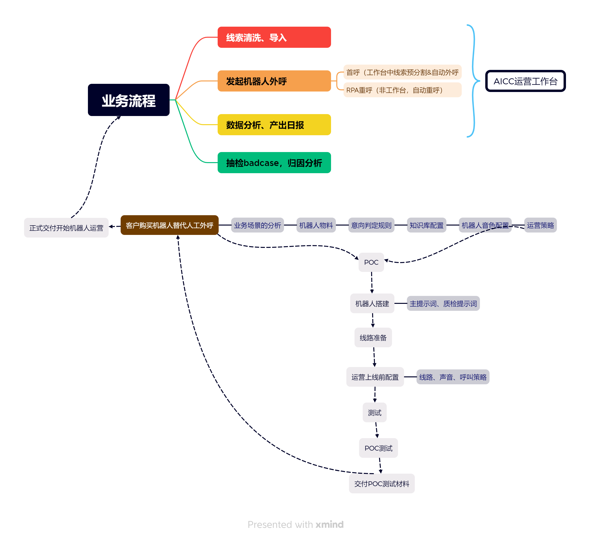

### 8.2 现有业务流程图

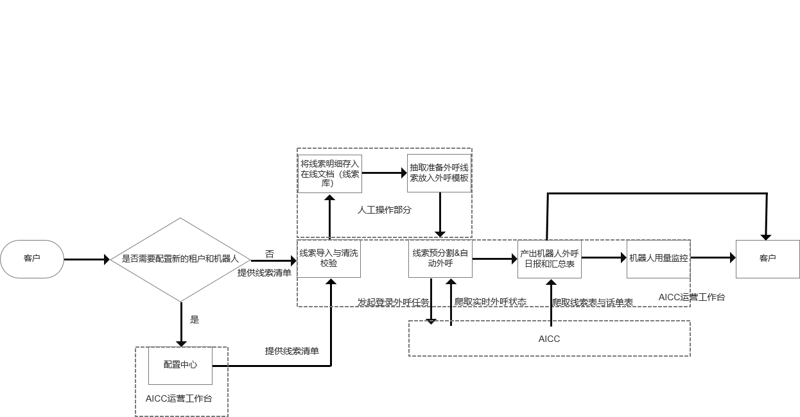

### 8.3 标准运营闭环

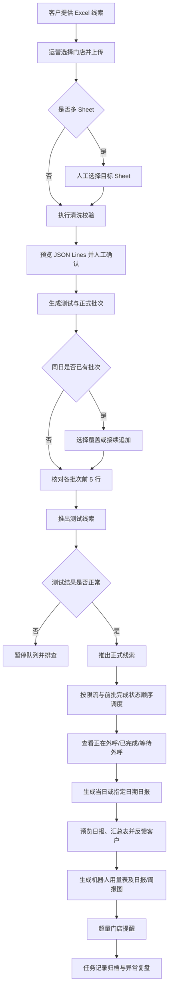
```mermaid
flowchart TD
    A[客户提供 Excel 线索] --> B[运营选择门店并上传]
    B --> C{是否多 Sheet}
    C -- 是 --> D[人工选择目标 Sheet]
    C -- 否 --> E[执行清洗校验]
    D --> E
    E --> F[预览 JSON Lines 并人工确认]
    F --> G[生成测试与正式批次]
    G --> H{同日是否已有批次}
    H -- 是 --> I[选择覆盖或接续追加]
    H -- 否 --> J[核对各批次前 5 行]
    I --> J
    J --> K[推出测试线索]
    K --> L{测试结果是否正常}
    L -- 否 --> M[暂停队列并排查]
    L -- 是 --> N[推出正式线索]
    N --> O[按限流与前批完成状态顺序调度]
    O --> P[查看正在外呼/已完成/等待外呼]
    P --> Q[生成当日或指定日期日报]
    Q --> R[预览日报、汇总表并反馈客户]
    R --> S[生成机器人用量表及日报/周报图]
    S --> T[超量门店提醒]
    T --> U[任务记录归档与异常复盘]
```

## 9. 信息架构

```text
AICC 运营工作台
├─ 线索导入
│  ├─ 门店选择 / 文件上传 / Sheet 选择
│  ├─ 校验结果
│  └─ TXT 阅读器 / 复制 / 下载
├─ 线索预分割&自动外呼
│  ├─ 动态门店子菜单
│  ├─ 文件选择 / 覆盖或追加 / 分割预览
│  ├─ 测试与正式外呼
│  └─ 队列状态 / 停止待外呼 / 继续待外呼
├─ 龙星行日报
│  ├─ 今日 / 特定日期日报
│  ├─ 月度或自定义区间横向汇总
│  ├─ 指定日期全门店汇总
│  └─ 进度 / 分区预览 / 复制与截图
├─ 机器人用量监控
│  ├─ 指定日期用量表
│  └─ 日报图 / 周报图
├─ 任务记录
│  └─ 类型、日期、状态、结果和日志
└─ 配置中心
   ├─ 导入线索脚本
   ├─ 预分割门店
   ├─ 自动外呼租户
   └─ 日报门店与机器人
```

## 10. 系统架构

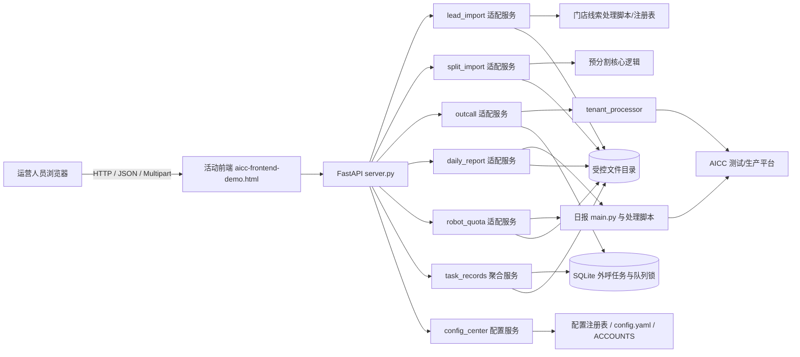
```mermaid
flowchart LR
    U[运营人员浏览器] -->|HTTP / JSON / Multipart| F[活动前端 aicc-frontend-demo.html]
    F --> API[FastAPI server.py]

    API --> LI[lead_import 适配服务]
    API --> SI[split_import 适配服务]
    API --> OC[outcall 适配服务]
    API --> DR[daily_report 适配服务]
    API --> RQ[robot_quota 适配服务]
    API --> TR[task_records 聚合服务]
    API --> CC[config_center 配置服务]

    LI --> LS[门店线索处理脚本/注册表]
    SI --> SS[预分割核心逻辑]
    OC --> TP[tenant_processor]
    TP --> AICC[AICC 测试/生产平台]
    DR --> RP[日报 main.py 与处理脚本]
    RP --> AICC
    RQ --> RP

    OC --> DB[(SQLite 外呼任务与队列锁)]
    LI --> FS[(受控文件目录)]
    SI --> FS
    DR --> FS
    RQ --> FS
    TR --> DB
    TR --> FS
    CC --> CFG[配置注册表 / config.yaml / ACCOUNTS]
```

### 10.1 统一任务协议目标

| 字段 | 说明 |
| --- | --- |
| `task_id` | 全局唯一任务 ID |
| `task_type` | 稳定任务类型，如 `lead_import`、`outcall_formal` |
| `task_name` | 运营可读名称，包含门店、日期或批次 |
| `operator` | 执行人，首期默认为“运营专员” |
| `status` | `pending/running/completed/failed/paused` |
| `progress` | 总进度、当前阶段、子任务状态 |
| `input_files` | 受控输入文件引用 |
| `output_files` | 可下载结果文件引用 |
| `error` | 结构化 `code/message/detail` |
| `created_at/completed_at` | 创建与完成时间 |
| `log_ref` | 日志文件引用，不直接回传敏感全量日志 |

> 当前代码尚未把所有任务统一写入 `task_runs` 表。目标态应建立统一任务台账；迁移前，任务记录继续兼容内存任务、SQLite 外呼任务和文件系统产物。

### 10.2 统一脚本执行协议

旧脚本通过适配层接入统一 `ScriptRunner` 协议，前端不得直接传入脚本路径或命令。每个适配器至少实现：

1. `validate(context)`：校验功能类型、门店、输入文件、配置和人工确认状态。
2. `prepare(context)`：在受控目录创建任务输入、工作目录和环境参数。
3. `run(context)`：调用 Python 函数或子进程，持续输出标准进度事件。
4. `collect(context)`：收集输出文件、预览数据、统计指标和日志引用。
5. `finalize(context)`：写入统一任务状态并执行限定范围内的清理。

标准进度事件应包含 `task_id`、`phase`、`current`、`total`、`message`、`store` 和 `status`；标准失败事件使用 `code/message/detail`，不得把凭据或完整客户数据写入 `detail`。

## 11. 核心系统流程

### 11.1 线索导入

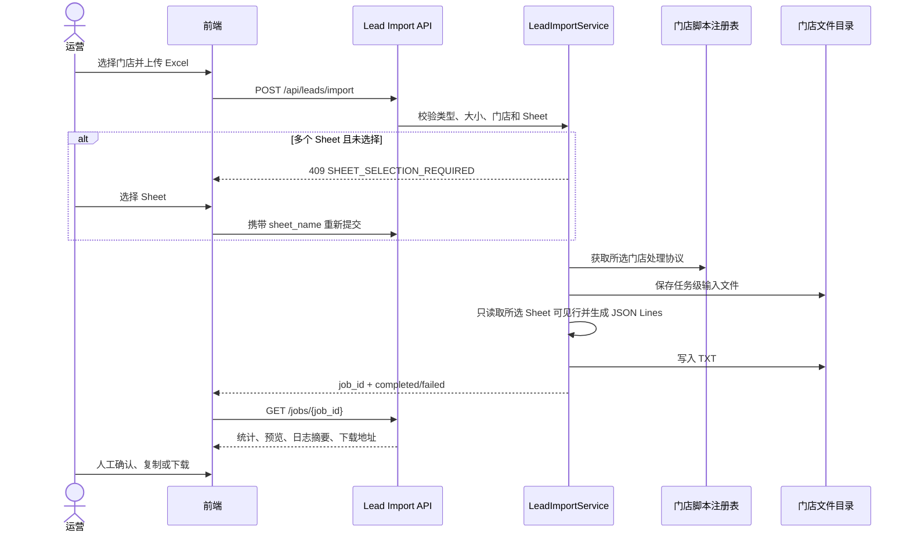
```mermaid
sequenceDiagram
    actor Ops as 运营
    participant Web as 前端
    participant API as Lead Import API
    participant Svc as LeadImportService
    participant Reg as 门店脚本注册表
    participant FS as 门店文件目录

    Ops->>Web: 选择门店并上传 Excel
    Web->>API: POST /api/leads/import
    API->>Svc: 校验类型、大小、门店和 Sheet
    alt 多个 Sheet 且未选择
        Svc-->>Web: 409 SHEET_SELECTION_REQUIRED
        Ops->>Web: 选择 Sheet
        Web->>API: 携带 sheet_name 重新提交
    end
    Svc->>Reg: 获取所选门店处理协议
    Svc->>FS: 保存任务级输入文件
    Svc->>Svc: 只读取所选 Sheet 可见行并生成 JSON Lines
    Svc->>FS: 写入 TXT
    Svc-->>Web: job_id + completed/failed
    Web->>API: GET /jobs/{job_id}
    API-->>Web: 统计、预览、日志摘要、下载地址
    Ops->>Web: 人工确认、复制或下载
```

### 11.2 预分割与自动外呼

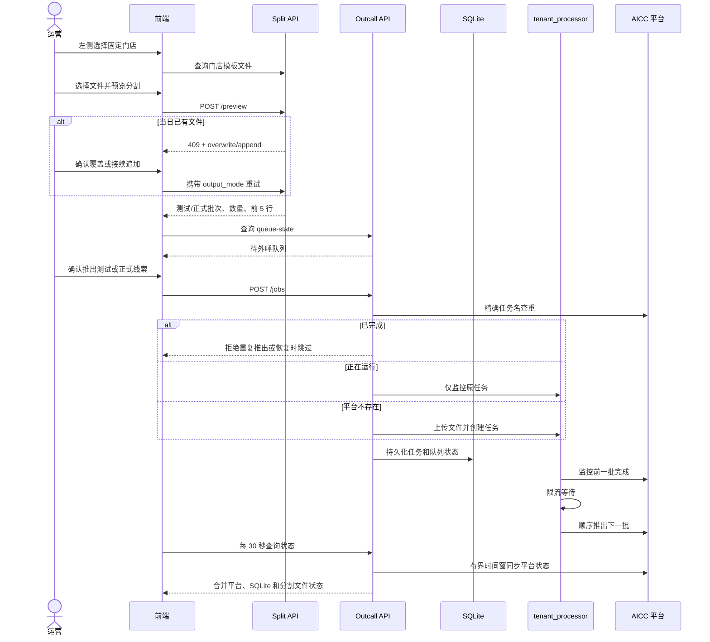
```mermaid
sequenceDiagram
    actor Ops as 运营
    participant Web as 前端
    participant Split as Split API
    participant Out as Outcall API
    participant DB as SQLite
    participant Core as tenant_processor
    participant P as AICC 平台

    Ops->>Web: 左侧选择固定门店
    Web->>Split: 查询门店模板文件
    Ops->>Web: 选择文件并预览分割
    Web->>Split: POST /preview
    alt 当日已有文件
        Split-->>Web: 409 + overwrite/append
        Ops->>Web: 确认覆盖或接续追加
        Web->>Split: 携带 output_mode 重试
    end
    Split-->>Web: 测试/正式批次、数量、前 5 行
    Web->>Out: 查询 queue-state
    Out-->>Web: 待外呼队列
    Ops->>Web: 确认推出测试或正式线索
    Web->>Out: POST /jobs
    Out->>P: 精确任务名查重
    alt 已完成
        Out-->>Web: 拒绝重复推出或恢复时跳过
    else 正在运行
        Out->>Core: 仅监控原任务
    else 平台不存在
        Out->>Core: 上传文件并创建任务
    end
    Out->>DB: 持久化任务和队列状态
    Core->>P: 监控前一批完成
    Core->>Core: 限流等待
    Core->>P: 顺序推出下一批
    Web->>Out: 每 30 秒查询状态
    Out->>P: 有界时间窗同步平台状态
    Out-->>Web: 合并平台、SQLite 和分割文件状态
```

### 11.3 暂停、恢复与服务重启

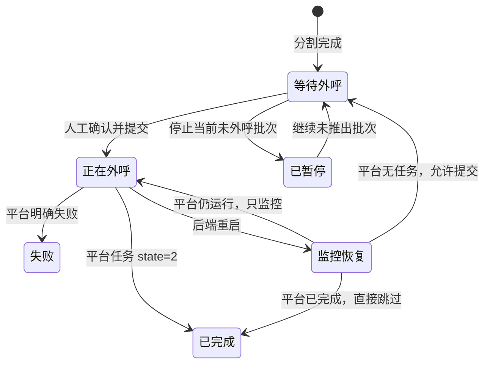
```mermaid
stateDiagram-v2
    [*] --> 等待外呼: 分割完成
    等待外呼 --> 正在外呼: 人工确认并提交
    正在外呼 --> 已完成: 平台任务 state=2
    正在外呼 --> 失败: 平台明确失败
    等待外呼 --> 已暂停: 停止当前未外呼批次
    已暂停 --> 等待外呼: 继续未推出批次
    正在外呼 --> 监控恢复: 后端重启
    监控恢复 --> 已完成: 平台已完成，直接跳过
    监控恢复 --> 正在外呼: 平台仍运行，只监控
    监控恢复 --> 等待外呼: 平台无任务，允许提交
```

恢复规则：

1. 平台任务 `state=2`：标记完成并跳过。
2. 平台任务 `state=1`：只恢复监控，不重新上传。
3. 平台不存在：才允许上传并发起。
4. 外部平台状态无法确认：展示本地降级状态，禁止自动重复提交。
5. 停止待外呼只锁定后续队列，不停止平台正在执行的任务。

### 11.4 龙星行日报

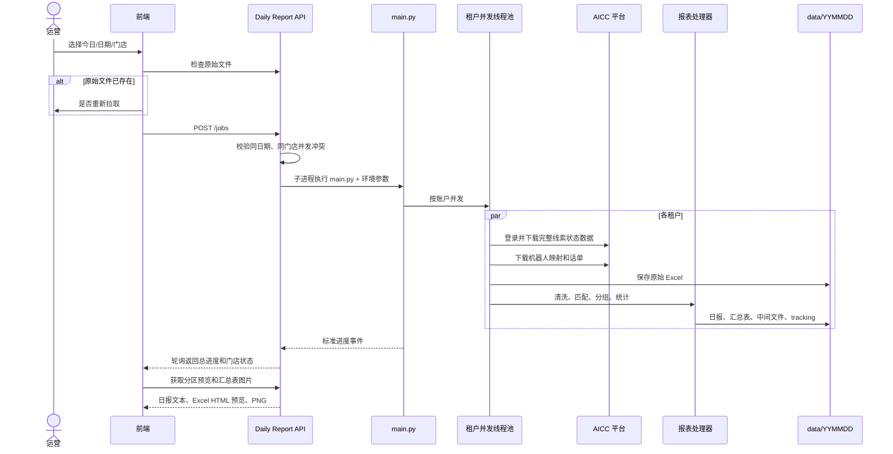
```mermaid
sequenceDiagram
    actor Ops as 运营
    participant Web as 前端
    participant API as Daily Report API
    participant Main as main.py
    participant Pool as 租户并发线程池
    participant P as AICC 平台
    participant Proc as 报表处理器
    participant FS as data/YYMMDD

    Ops->>Web: 选择今日/日期/门店
    Web->>API: 检查原始文件
    alt 原始文件已存在
        Web->>Ops: 是否重新拉取
    end
    Web->>API: POST /jobs
    API->>API: 校验同日期、同门店并发冲突
    API->>Main: 子进程执行 main.py + 环境参数
    Main->>Pool: 按账户并发
    par 各租户
        Pool->>P: 登录并下载完整线索状态数据
        Pool->>P: 下载机器人映射和话单
        Pool->>FS: 保存原始 Excel
        Pool->>Proc: 清洗、匹配、分组、统计
        Proc->>FS: 日报、汇总表、中间文件、tracking
    end
    Main-->>API: 标准进度事件
    API-->>Web: 轮询返回总进度和门店状态
    Web->>API: 获取分区预览和汇总表图片
    API-->>Web: 日报文本、Excel HTML 预览、PNG
```

日报关键口径：

- 当天新增线索：`线索下发时间 == 目标日期` 的唯一线索 ID。
- 当天接通线索：当天新增线索匹配到的终态话单中，通话状态含“已接通”。
- 当天呼叫通次：目标日期内且属于当天新增线索的话单行数，不按线索去重。
- MTD：优先使用目标日完整快照；如配置 `mtd_start_date`，按该下界统计。
- 多机器人租户：按机器人映射拆分；无法映射的数据进入“未匹配”，不得静默丢失。
- 一致性校验：原始线索数应等于各机器人新增线索量、明确排除量和未匹配量之和。

### 11.5 机器人用量监控

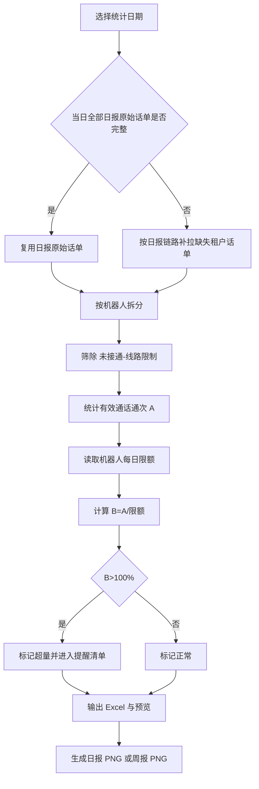
```mermaid
flowchart TD
    A[选择统计日期] --> B{当日全部日报原始话单是否完整}
    B -- 是 --> C[复用日报原始话单]
    B -- 否 --> D[按日报链路补拉缺失租户话单]
    C --> E[按机器人拆分]
    D --> E
    E --> F[筛除 未接通-线路限制]
    F --> G[统计有效通话通次 A]
    G --> H[读取机器人每日限额]
    H --> I[计算 B=A/限额]
    I --> J{B>100%}
    J -- 是 --> K[标记超量并进入提醒清单]
    J -- 否 --> L[标记正常]
    K --> M[输出 Excel 与预览]
    L --> M
    M --> N[生成日报 PNG 或周报 PNG]
```

### 11.6 任务记录与配置中心

- 任务记录是只读聚合视图，不应在查询时启动、重跑、停止或修改业务任务。
- 内存任务优先提供实时状态，文件系统产物补充服务重启前历史，去重后统一展示。
- 配置中心通过 API 更新受控注册表、外呼 `tenants` 和日报 `ACCOUNTS`。
- 同名日报账户先返回冲突，只有用户确认 `force_reconfigure` 后才原位替换。
- 生产外呼账号、密码和机器人 ID 为必填项；测试环境字段可为空。

## 12. 页面与交互原型

### 12.1 总体布局

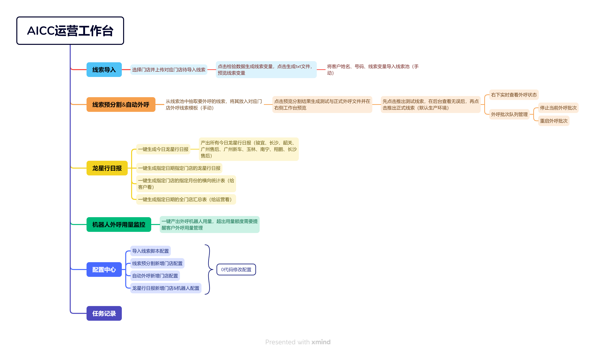

- 登录后左侧为固定深色侧边栏，工作区滚动时侧栏不随页面滑走。
- 主导航包含六个模块；仅在线索预分割页面显示并高亮当前门店子菜单。
- 顶部显示当前路径和执行人，主体采用适合运营扫描的面板、状态标签和表格。

### 12.2 线索导入

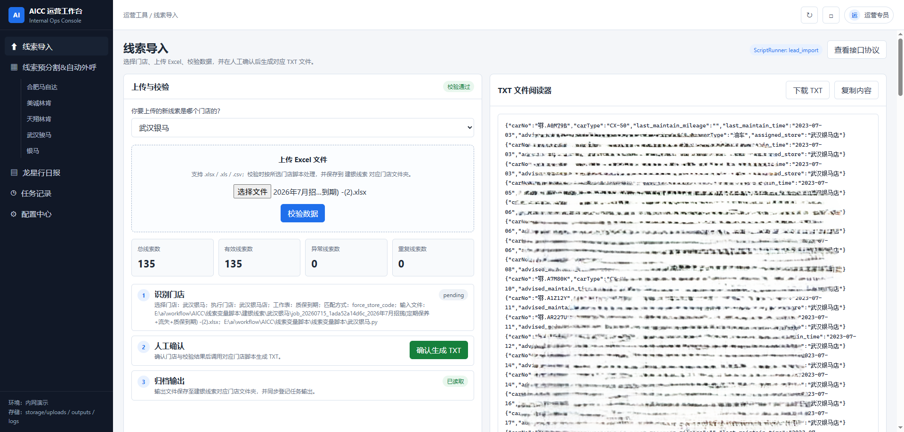

- 左侧完成门店选择、文件上传、校验、统计和人工确认。
- 右侧白底黑字 TXT 阅读器按 JSON Lines 展示，可复制和下载。
- 多 Sheet 时弹出 Sheet 选择窗口，确认后再处理。

### 12.3 线索预分割与自动外呼

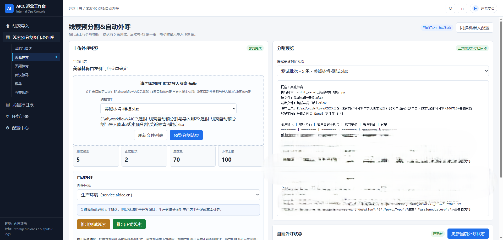

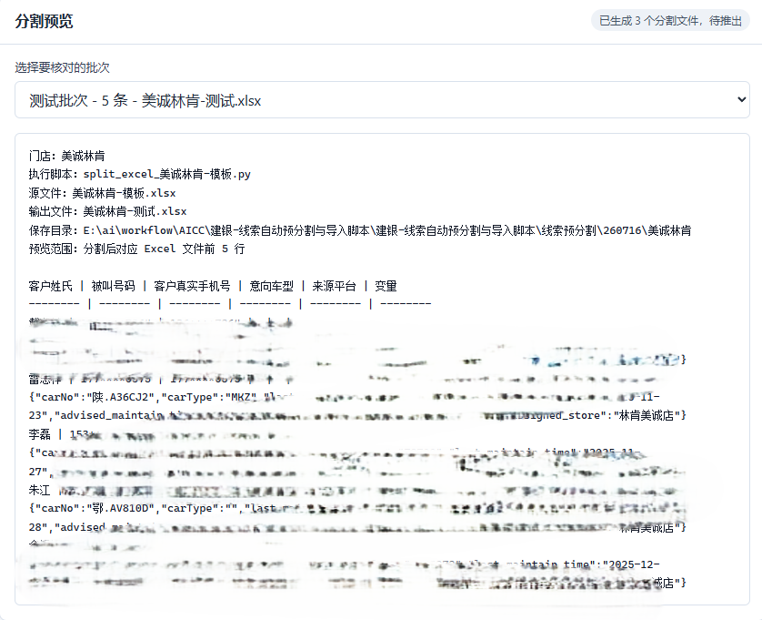

- 当前门店由左侧子菜单固定，不在工作区重复选择。
- 分割预览下拉按“测试、正式数字批次”排序，每个批次展示前 5 行脱敏数据。
- 自动外呼默认生产环境，测试与正式按钮分离。
- 当前外呼状态固定展示正在外呼、已完成、等待外呼和平台同步提示。
- 当日已有文件时提供“覆盖原文件”与“继续添加”两种明确选择。

### 12.4 龙星行日报

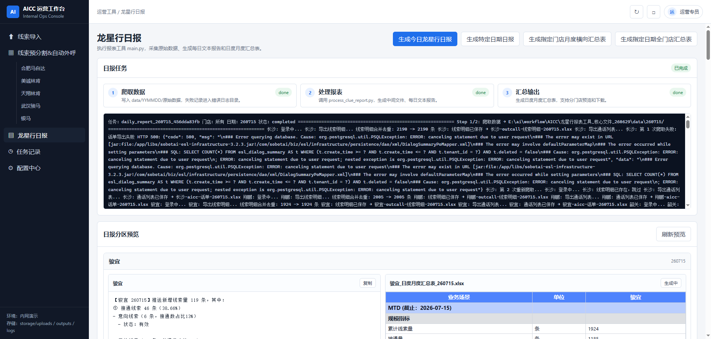

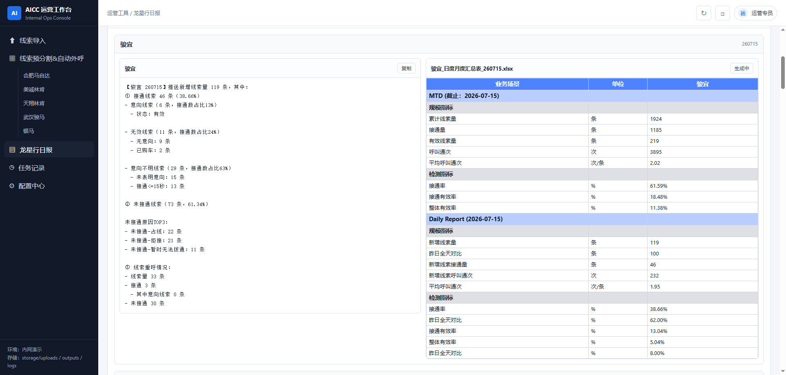

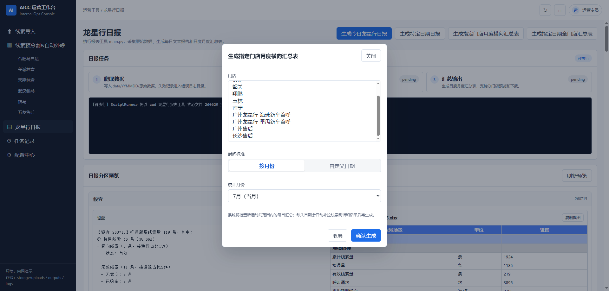

- 日报任务横向置于工作区顶部，展示三阶段和租户级进度。
- 下方按业务分区展示日报文本和汇总表。
- 汇总表保留 Excel 样式，支持复制截图；宽表允许横向滚动。
- 月度/区间汇总生成后自动滚动到新分区，并短暂淡蓝高亮。

### 12.5 机器人用量监控

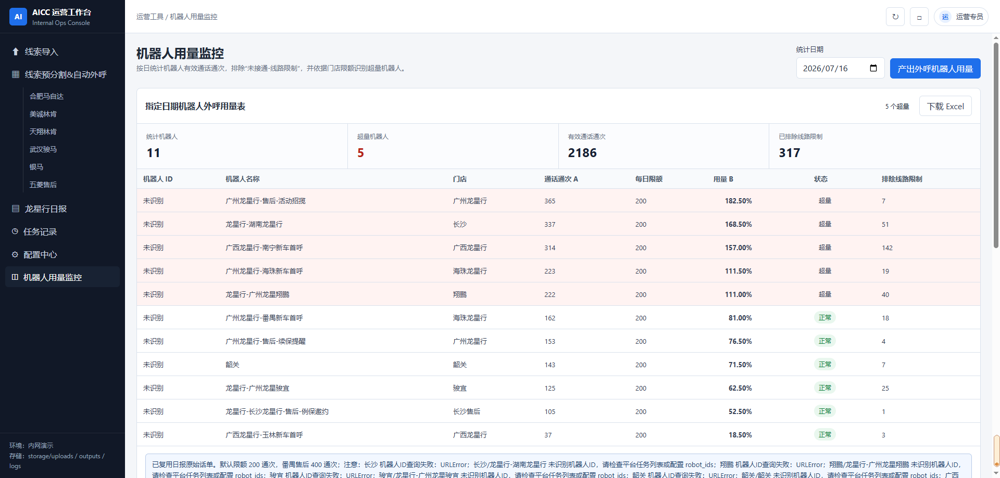

- 顶部选择日期并生成用量表。
- 概览展示机器人数量、超量数量、有效通次和已排除线路限制数量。
- 明细展示机器人 ID、名称、门店、A、限额、B 和状态。
- 下方生成指定日图片或指定周图片。

### 12.6 任务记录

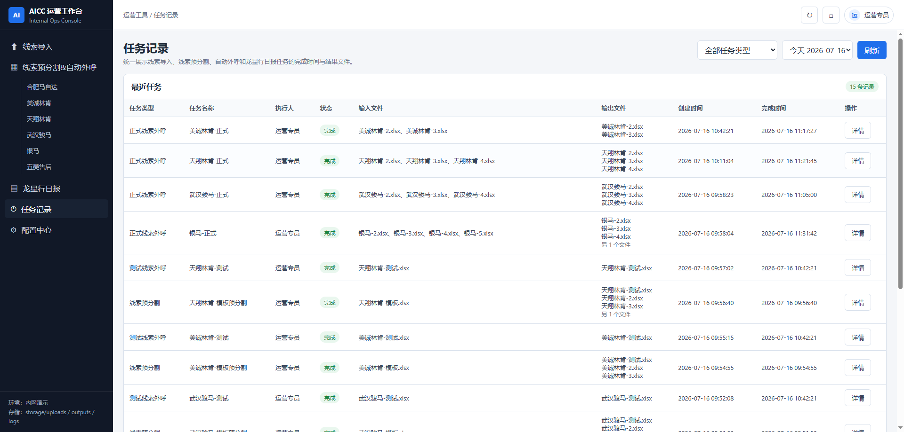

- 支持任务类型、近一周/指定日期筛选和手动刷新。
- 展示任务类型、任务名称、执行人、状态、输入、输出、创建/完成时间和操作。

### 12.7 配置中心

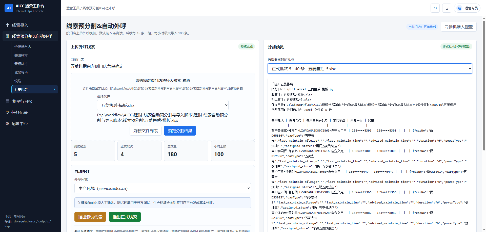

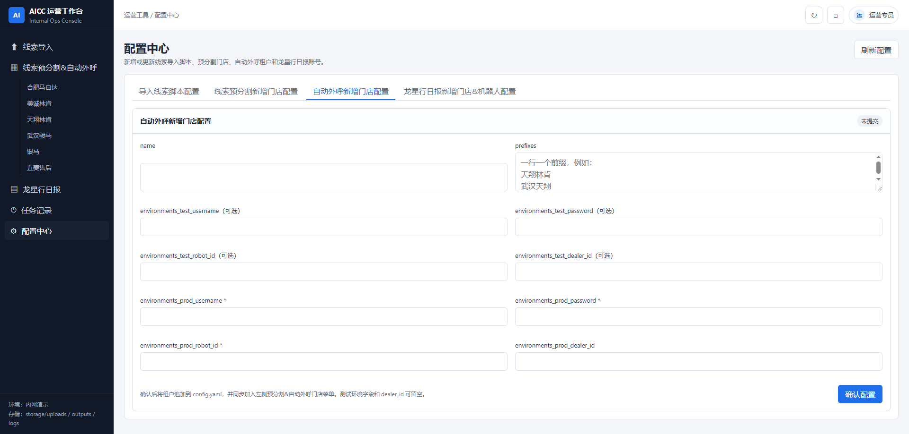

- 使用四个标签页隔离不同配置对象。
- 新增配置成功后应动态进入对应业务菜单和运行时注册表。
- 密码字段只允许写入，不在配置摘要或成功响应中回显。

## 13. 状态、错误与确认规范

### 13.1 通用任务状态

| 状态 | 用户含义 | 可用操作 |
| --- | --- | --- |
| `pending` | 等待执行或等待前置条件 | 查看详情、取消未提交任务 |
| `running` | 正在执行 | 查看进度和日志摘要 |
| `paused` | 后续队列已锁定 | 继续未推出批次 |
| `completed` | 成功完成 | 预览、复制、下载 |
| `failed` | 执行失败 | 查看错误、按规则重试 |

### 13.2 错误协议

所有 API 错误统一返回：

```json
{
  "error": {
    "code": "STABLE_ERROR_CODE",
    "message": "面向用户的错误摘要",
    "detail": "脱敏后的诊断信息"
  }
}
```

典型 HTTP 语义：

- `400`：一般业务错误。
- `404`：任务或输出不存在。
- `409`：需要用户决策、任务冲突或重复提交。
- `413`：上传文件过大。
- `422`：参数或配置校验失败。
- `502`：外部平台状态查询失败；可降级场景应同时保留本地状态。

### 13.3 必须确认的动作

- 生产环境推出测试线索或正式线索。
- 重复文件重新发起外呼。
- 覆盖当日已有分割文件。
- 停止或继续待外呼队列。
- 已有原始文件时重新拉取并覆盖。
- 重复生成月度、区间或全门店汇总表。
- 覆盖同名脚本、租户或日报账户配置。

## 14. 数据与文件规范

| 数据类型 | 目标位置/载体 | 保留原则 |
| --- | --- | --- |
| 上传文件 | 服务端受控上传或门店输入目录 | 使用安全文件名和任务 ID，禁止客户端指定任意路径 |
| 线索变量 TXT | 门店输出目录 | JSON Lines，一行一条 |
| 分割 Excel | `线索预分割/YYMMDD/门店/` | 测试优先、正式数字批次 |
| 外呼任务状态 | SQLite + AICC 平台 | 本地证据与平台状态合并 |
| 日报原始数据 | `data/YYMMDD/原始数据/` | 重拉只覆盖目标日期和门店 |
| 日报输出 | 每日报告、汇总表、中间文件、错误日志 | 文件名包含门店/机器人和日期 |
| tracking | `_tracking/YYMM/对象.json` | 保存日度统计与目标日 MTD 快照 |
| 用量结果 | `机器人用量监控/data、reports、logs` | Excel 明细和日报/周报 PNG |
| 任务记录 | 目标态 `task_runs` + 文件引用 | 不复制敏感客户数据和完整凭据 |

## 15. 非功能需求

### 15.1 性能

- 普通按钮点击后 1 秒内显示本地处理状态。
- 外呼平台状态默认每 30 秒同步，单次交互查询应设置总超时和有界时间窗。
- 日报按账户并发，默认并发数可配置；不得对同日期、同门店重复并发。
- 大型 Excel 处理不得阻塞其他 API 的状态查询。
- 日报和宽表预览按需加载图片，避免首次页面加载全部大文件。

### 15.2 可靠性

- 外呼提交具备精确任务名查重和文件前 5 行签名校验。
- 网络中断后先查询平台，不直接重试创建任务。
- 队列锁和运行任务可在服务重启后恢复。
- 文件覆盖操作限定到明确日期和门店，不允许清理上级目录。
- 日报下载状态枚举完整；机器人映射失败可降级，但未匹配数据必须显式输出。

### 15.3 安全与隐私

- 手机号在前端列表和预览中脱敏。
- 密码、令牌、Cookie、完整账号对象不得写入日志、任务记录或文档。
- 客户不能通过请求传入脚本路径或输出目录。
- 上传扩展名、大小、Sheet 名、文件名和路径都需校验。
- 正式上线前必须补充真实鉴权、角色权限、会话超时和操作审计。

### 15.4 兼容性与可用性

- 首期支持最新版 Chrome 和 Edge。
- 必须通过 `http://127.0.0.1:18765/aicc-frontend-demo.html` 访问，不支持 `file://` 执行业务功能。
- 固定侧栏、响应式布局，文本和按钮不得溢出或重叠。
- 剪贴板图片能力不可用时提供下载 PNG 的明确兜底。

## 16. API 能力清单

| 模块 | 主要 API | 用途 |
| --- | --- | --- |
| 线索导入 | `GET /api/leads/import/stores` | 获取已注册门店 |
| 线索导入 | `POST /api/leads/import` | 上传并处理线索，支持 Sheet 参数 |
| 线索导入 | `GET /api/leads/import/jobs/{id}` | 获取统计、预览和错误 |
| 线索导入 | `GET /api/leads/import/jobs/{id}/download` | 下载 TXT |
| 预分割 | `GET /api/leads/split/stores`、`/files` | 获取动态门店和模板文件 |
| 预分割 | `POST /api/leads/split/preview` | 生成或追加批次 |
| 自动外呼 | `POST /api/leads/outcall/jobs` | 创建测试/正式外呼任务 |
| 自动外呼 | `GET /api/leads/outcall/stores/{store}/queue-state` | 获取合并队列状态 |
| 自动外呼 | `POST .../stop-pending`、`resume-pending` | 暂停/恢复后续队列 |
| 日报 | `POST /api/daily-report/jobs`、`GET .../jobs/{id}` | 启动和轮询日报 |
| 日报 | `GET /api/daily-report/preview`、`summary-image` | 分区预览和截图 |
| 日报 | `POST /api/daily-report/monthly-summary` | 月度或区间横向汇总 |
| 日报 | `POST /api/daily-report/all-store-summary` | 全门店横向汇总 |
| 用量 | `POST /api/robot-quota/jobs`、`GET .../preview` | 生成与预览用量表 |
| 用量 | `POST .../reports/daily`、`reports/weekly` | 生成日报/周报图 |
| 任务 | `GET /api/task-records` | 按类型和日期查询 |
| 配置 | `GET /api/config-center/summary` | 获取脱敏配置摘要 |
| 配置 | `POST /api/config-center/*` | 保存四类配置 |

## 17. 验收方案

### 17.1 P0 验收场景

1. 上传包含多个 Sheet 的 Excel，系统必须要求选择 Sheet；输出条数与可见有效行一致。
2. 同日同门店第二次分割，覆盖模式清空旧门店批次，追加模式从最大正式批次号接续。
3. 测试线索提交后 1 秒内进入“正在外呼”，平台完成后进入“已完成”。
4. 正式批次有多个文件时，前一批未完成不得提交下一批。
5. 模拟网络超时，状态栏仍展示 SQLite 和分割文件形成的本地队列，并提示同步失败。
6. 模拟提交响应丢失，恢复后查询到同名平台任务，不得再次创建。
7. 后端重启后，运行中批次恢复监控，等待批次仍可继续。
8. 生成全部日报时，多个租户并发执行，单租户失败在进度条中独立显示。
9. 多机器人租户统计满足线索总数对账，未匹配记录不被静默忽略。
10. 配置中心新增门店后，对应下拉、侧边栏和后端运行注册表立即更新。

### 17.2 报表准确性验收

- 从每类门店抽取至少 3 个日期进行人工对账。
- 对账字段包括新增线索量、新增接通量、呼叫通次、有效线索量和四类比率。
- 同一线索多通话时，线索统计使用终态，呼叫通次保留全部有效话单行。
- 多机器人租户按机器人归属对账，并核对未匹配与明确排除量。
- MTD 目标日快照与原始整段数据回切结果一致。
- 百分比在 Excel、HTML 预览和 PNG 中保持相同小数精度。

### 17.3 安全验收

- API 不接受任意脚本路径和任意输出目录。
- 日志、任务详情、配置摘要中检索不到密码、令牌和完整手机号。
- 所有生产外呼和覆盖类动作均存在确认步骤。
- 不同门店切换后文件、账号、机器人和状态无串租户。

## 18. 埋点与运营看板

建议记录以下不含客户敏感数据的事件：

| 事件 | 关键属性 |
| --- | --- |
| `task_created` | 任务类型、门店、环境、创建时间 |
| `task_completed` | 任务类型、耗时、结果文件数量 |
| `task_failed` | 错误码、阶段、是否外部平台错误 |
| `manual_confirmation` | 操作类型、用户选择、等待时长 |
| `duplicate_blocked` | 门店、批次类型、命中方式 |
| `queue_paused/resumed` | 门店、待处理批次数 |
| `report_reconciled` | 门店、总线索、已分配、排除、未匹配 |
| `quota_exceeded` | 门店、机器人、用量区间 |

运营看板至少应展示任务完成率、业务抽检准确率、平均人工耗时、平均自动化耗时、失败错误码 TOP5、重复外呼拦截数和超量机器人数量。

## 19. 上线与运营计划

| 阶段 | 租户数量 | 机器人数量 | 持续时间 | 观察指标 | 进入下一阶段条件 |
| --- | ---: | ---: | --- | --- | --- |
| 内部测试 | 1 | 1 | 1 周 | 任务完成率、P0 缺陷、重复提交 | 任务完成率 ≥ 98%，无未关闭 P0，重复外呼事故为 0 |
| 灰度上线 | 4 | 6 | 半个月 | 任务完成率、业务准确率、外部平台异常恢复 | 任务完成率 ≥ 98%，业务准确率 ≥ 95%，关键恢复场景通过 |
| 扩大灰度 | 7 | 11 | 1 个月 | 完成率、准确率、人工耗时、自动化耗时 | 完成率 ≥ 99%，准确率 ≥ 98%；单租户线索操作约 1 分钟；人工核验 ≤ 5 分钟；单机器人日报 ≤ 2 分钟 |
| 全量上线 | 13 | 17 | 持续运营 | 全量指标、容量、异常率、运营产能 | 按月复盘，持续满足 SLA，重大事故有复盘和改进闭环 |

### 19.1 上线前准备

1. 建立正式环境配置清单和门店/机器人责任人。
2. 对全部生产租户执行只读登录、状态查询和数据下载验证。
3. 使用脱敏线索完成预分割、测试环境外呼和日报准确性回归。
4. 建立生产外呼确认 SOP、异常停止 SOP 和重复提交事故预案。
5. 为运营人员培训六个模块，提供常见错误码和处理手册。
6. 备份 SQLite、配置文件和关键目录，验证恢复流程。

### 19.2 日常运营机制

- 每日开始前检查后端健康状态、磁盘空间和平台连通性。
- 先测试线索，确认机器人、号码和任务名称后再推出正式批次。
- 每日完成后核对任务记录、失败门店、日报对账和用量超限名单。
- 每周复盘失败错误码、人工耗时、重复拦截和外部平台性能。
- 配置变更执行“双人复核”，并保留变更前备份和验证记录。

### 19.3 回滚与应急

- 前端异常：保留旧版本 HTML，可切回上一稳定版本。
- 适配层异常：停止新任务创建，已在平台运行的任务继续由平台执行。
- 队列异常：暂停待外呼批次，核对平台任务后再恢复。
- 日报异常：保留原始数据，修复处理逻辑后仅重跑目标日期/门店。
- 配置异常：恢复备份配置并重启加载，禁止直接编辑运行产物伪造结果。

## 20. 当前差距与后续迭代

| 差距 | 风险 | 建议版本 |
| --- | --- | --- |
| 登录页是演示态，无真实鉴权与 RBAC | 未授权操作、无法追责 | V1.1 P0 |
| 所有任务尚未统一写入 `task_runs` | 任务重启恢复和统一审计不完整 | V1.1 P0 |
| 前端 API 地址固定本机端口 | 不利于正式部署与多环境切换 | V1.1 P0 |
| CORS 当前允许全部来源 | 正式环境攻击面扩大 | V1.1 P0 |
| 部分任务状态仍依赖内存和文件扫描 | 历史状态可能不完整或重复 | V1.1 P1 |
| 缺少统一用户级操作审计 | 无法回答“谁在何时执行何操作” | V1.1 P1 |
| 缺少系统化监控告警 | 外部平台和长任务故障发现不及时 | V1.2 P1 |
| 旧脚本仍存在硬编码和编码历史问题 | 新门店扩展和维护风险 | V1.2 持续治理 |

## 21. 风险与依赖

| 风险/依赖 | 影响 | 应对 |
| --- | --- | --- |
| AICC 平台接口速度、分页和状态语义变化 | 状态查询慢、数据下载不全 | 有界查询、超时、状态枚举回归、降级本地状态 |
| 平台提交成功但响应丢失 | 重复外呼 | 精确任务名查询、幂等恢复、禁止不确定状态下重试 |
| 多机器人映射字段不完整 | 日报分组和新增线索量错误 | 映射降级、未匹配输出、总量一致性校验 |
| 原始线索状态导出不完整 | 日报和 MTD 偏小 | 完整枚举已完成、待外呼、待重呼、未外呼等状态 |
| 本地文件被人工改名或覆盖 | 任务记录和汇总来源错误 | 任务 ID、文件签名、限定目录、覆盖确认 |
| 凭据存放在代码配置文件 | 泄露风险 | 迁移到环境变量或密钥服务，响应与日志持续脱敏 |
| 单机部署和磁盘依赖 | 服务中断或产物丢失 | 定期备份、空间告警、任务台账和恢复演练 |

## 22. 待评审决策

1. 正式上线使用企业 SSO、AICC 账号体系还是独立账号体系。
2. `task_runs` 的保留周期、日志保留周期和客户数据清理周期。
3. 生产外呼是否需要运营专员与负责人双人确认。
4. 外呼状态 30 秒自动同步是全门店并发还是仅同步当前门店。
5. 日报业务准确率的抽检样本、责任人和争议口径确认机制。
6. 机器人用量超限后采用群通知、邮件、企业 IM 还是仅工作台提示。
7. 全量部署采用单机内网、服务器部署还是容器化部署。

## 23. 术语

| 术语 | 定义 |
| --- | --- |
| 线索变量 | 将客户 Excel 字段清洗、标准化后生成的机器人可用 JSON Lines 文本 |
| 测试线索 | 分割后的首批少量线索，默认前 5 条 |
| 正式批次 | 测试线索之后按 45 条一组形成的外呼文件 |
| MTD | Month To Date；本月或配置起始日至目标日的累计指标 |
| tracking | 按月、门店或机器人保存的日报统计和 MTD 快照 |
| 通次 A | 排除“未接通-线路限制”后的机器人通话记录数 |
| 用量 B | 通次 A / 机器人每日限额 |
| 降级状态 | 外部平台查询失败时，根据 SQLite 和本地文件展示的可验证状态 |
| 重呼兜底 | 提交前通过任务名和文件内容识别已外呼文件，阻止重复推出 |
