# AICC 运营工作台

面向内部运营团队的一体化线索处理与外呼运营平台

  <strong>线索导入</strong> · <strong>线索预分割</strong> · <strong>自动外呼</strong> ·
  <strong>龙星行日报</strong> · <strong>机器人用量监控</strong> · <strong>任务记录</strong> · <strong>配置中心</strong>

  <a href=AICC运营工作台_PRD.md><strong>产品需求文档 PRD</strong></a> ·
  <a href=#系统设计><strong>系统设计</strong></a>

## 个人作品

这是一个从真实汽车经销商 AI 外呼运营场景出发，完成**产品定义、交互设计、全栈开发、旧脚本服务化和运营可靠性治理**的个人项目。作品重点不是单一页面或脚本，而是把线索处理、自动外呼、日报交付和机器人用量监控串成可确认、可追踪、可恢复的完整工作流。

我在项目中重点完成了以下工作：

| 能力方向 | 作品内容 |
| --- | --- |
| 产品设计 | 梳理运营角色、业务痛点和操作闭环，形成 26 项分级需求、验收标准、灰度计划和风险预案 |
| 交互设计 | 设计企业后台工作台、批次预览、人工确认、外呼队列、日报进度和结果截图等运营交互 |
| 全栈开发 | 使用原生 HTML/CSS/JavaScript 构建活动前端，以 FastAPI 组装七个业务适配模块 |
| 遗留系统集成 | 在不大规模重构旧 Python 脚本的前提下，通过适配层统一输入、状态、错误和输出协议 |
| 可靠性设计 | 实现外呼防重、顺序调度、限流、暂停/恢复、SQLite 持久化和服务重启后的任务恢复 |
| 数据产品 | 建立日报、MTD、横向汇总、全门店汇总和机器人用量监控链路，并提供浏览器预览与截图 |

**作品文档：** [查看完整《AICC 运营工作台产品需求文档（PRD）》](AICC运营工作台_PRD.md)

### 产品工作流

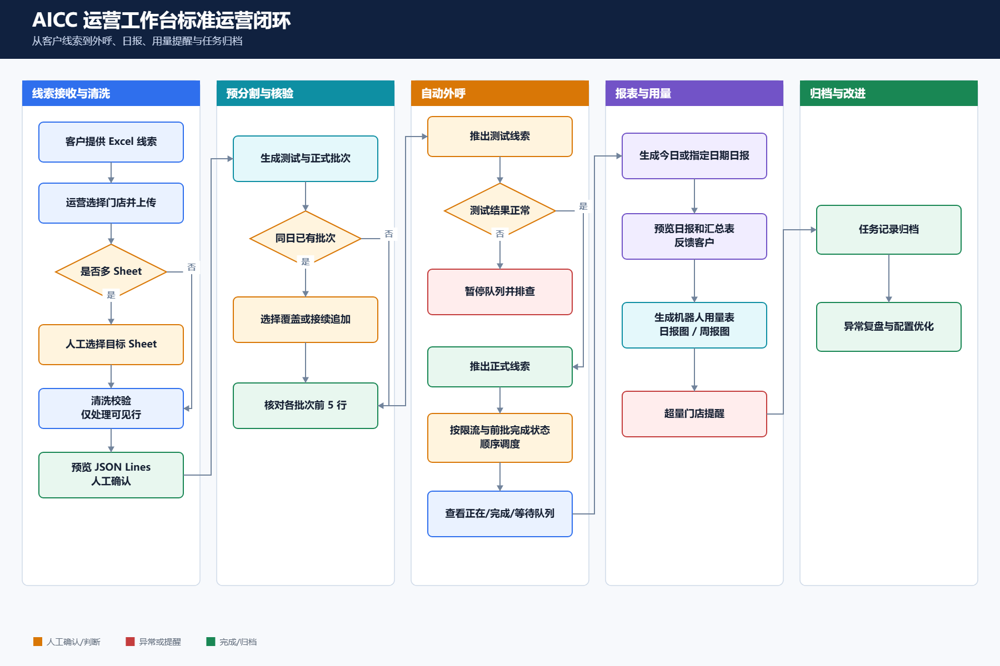

### 系统设计

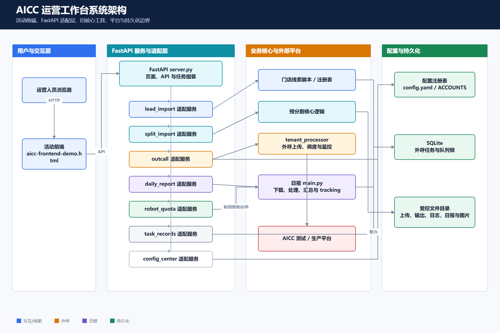

<strong>查看各核心模块系统流程图</strong>

#### 线索导入

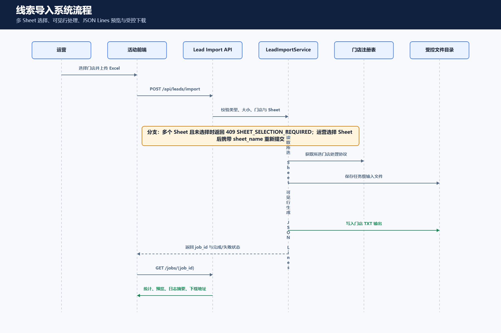

#### 线索预分割与自动外呼

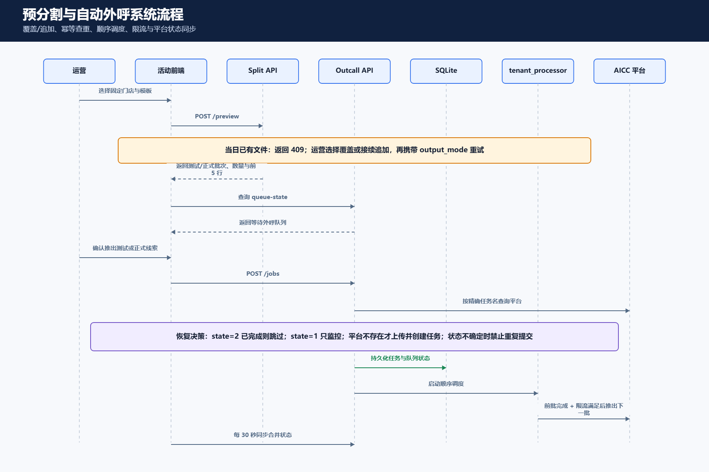

#### 外呼暂停、恢复与服务重启

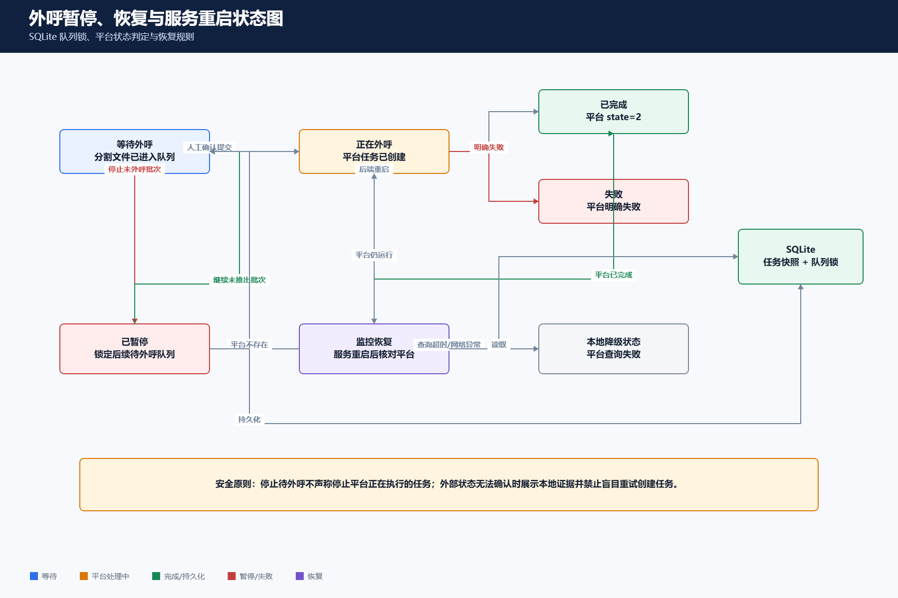

#### 龙星行日报

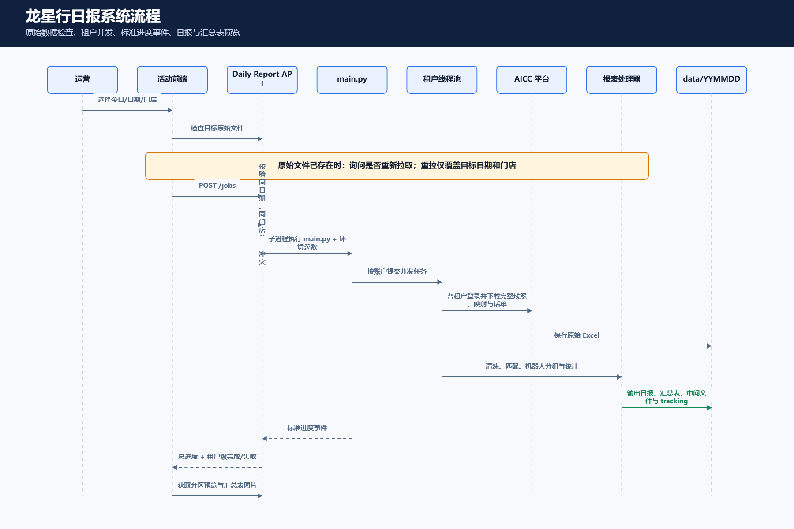

#### 机器人用量监控

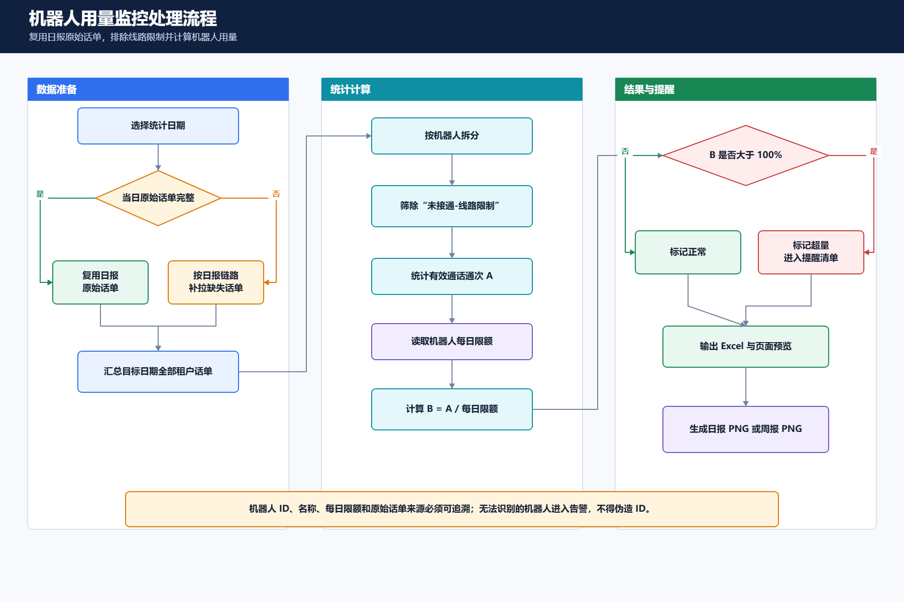

## 项目简介

AICC 运营工作台将已有 Python 运营脚本通过 FastAPI 适配层服务化，并提供统一的网页操作入口。运营人员可以在浏览器中完成文件上传、数据校验、批次分割、外呼任务发起、日报生成、结果预览、文件下载、任务追踪和门店配置。

平台保持原有脚本的业务逻辑，通过适配层统一管理任务状态、错误返回、运行日志和输出文件，便于后续继续接入新的运营工具。

### 业务背景

汽车门店和经销商使用机器人替代部分人工客服工作，完成看车、保养等场景的客户邀约。不同门店采购的机器人类型、业务话术和活动内容各不相同，运营团队需要持续完成个性化配置、日常外呼、数据处理和结果反馈。

### 业务目标

- 完成客户购买机器人后的配置、调试和运营使用。
- 持续追踪机器人外呼接通率、意向客户率和有效下发率。
- 将重复的线索处理、批次外呼、状态跟踪和报表工作集中到一个工作台。

### 运营流程

门店运营负责线索清洗导入、机器人场景配置、Prompt 调优、拨测调试、正式外呼、外呼数据分析和客户反馈的完整流程，并每日抽检机器人外呼 Case，对 Bad Case 进行分析归因。

## 业务流程

## 核心能力

| 功能模块 | 主要能力 | 典型输出 |
| --- | --- | --- |
| 线索导入 | 选择门店、上传 Excel、选择 Sheet、校验并执行门店脚本 | 门店 TXT 线索文件 |
| 线索预分割与自动外呼 | 模板预分割、批次预览、测试/正式外呼、状态查询、停止与恢复队列 | 分批 Excel、外呼任务状态 |
| 龙星行日报 | 今日/历史日报、月度或自定义区间横向汇总、全门店汇总 | 日报、汇总表、截图预览 |
| 机器人用量监控 | 排除线路限制通次、按机器人计算限额使用率、生成日报/周报图 | 每日用量 Excel、日报 PNG、周报 PNG |
| 任务记录 | 按类型和时间查询任务，查看状态、日志与结果文件 | 任务明细、下载链接 |
| 配置中心 | 新增导入脚本、预分割门店、外呼租户、日报门店和机器人 | 持久化配置与动态菜单 |

## 功能展示

### 1. 线索导入

选择门店和 Excel 文件后，系统调用对应门店脚本完成数据处理。工作表包含多个 Sheet 时可人工选择，生成结果可直接在页面文本阅读器中核验。

### 2. 线索预分割与自动外呼

点击“预览分割结果”后，系统将前 5 条线索划为测试批次，后续线索每 45 条划为一个正式批次，每小时最多导入 100 条，避免一次性外呼过多线索触发线路限制。页面同步展示测试线索数、正式批次数、线索总数和小时上限。

<strong>查看分割预览与外呼操作截图</strong>

#### 分割文件预览

分割预览用于人工校对外呼线索是否与线索池及客户提供的明细一致，避免反复打开多个 Excel 文件。

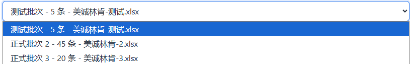

#### 门店外呼工作台

自动外呼默认使用生产环境，提供推出测试线索、推出正式线索、停止当前未外呼批次和继续未推出批次四项核心操作。系统按门店维护独立状态；正式批次按顺序执行，前一批完成后再处理下一批。后端重启后可依据平台任务状态与 SQLite 恢复未推出队列。

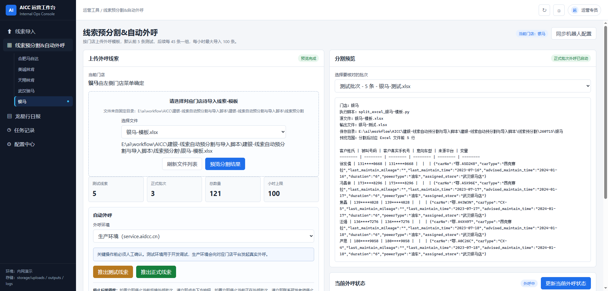

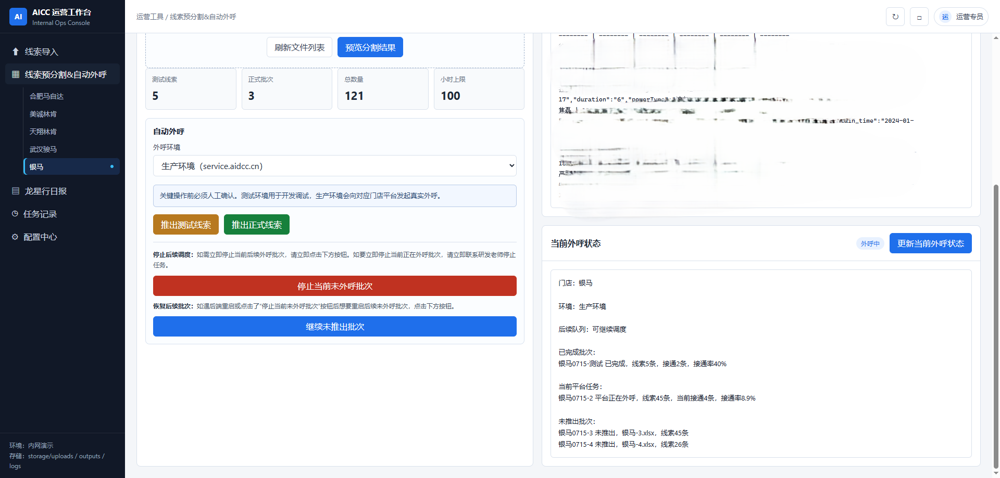

#### 推出测试与正式批次

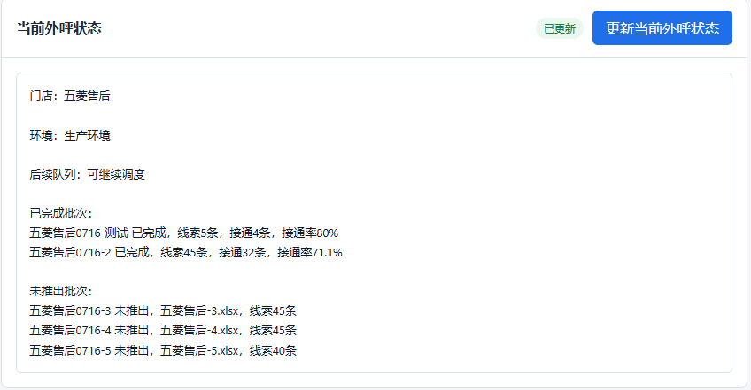

#### 重复外呼兜底

为避免相同线索被重复推出，系统在发起外呼前比对门店分割文件与平台任务队列；识别到重复文件及相同样本后会阻止操作并提示人工确认是否重新发起。

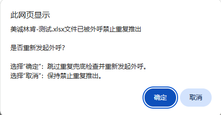

### 3. 龙星行日报

日报模块按账户和机器人配置动态扩展，支持生成今日或指定日期日报。页面按门店展示日报与汇总表，并支持复制完整表格截图。

<strong>查看日报预览与汇总表截图</strong>

针对门店在指定时间范围内对比每日 MTD 和 Daily 数据的需求，系统支持按月份或自定义区间生成指定门店横向汇总表。

运营还可以选择指定日期生成全门店机器人汇总表，集中查看当天所有租户与机器人的外呼数据。

### 4. 任务记录

任务记录统一展示线索导入、预分割、测试外呼、正式外呼、日报和机器人用量任务，支持按任务类型及时间筛选，并查看任务状态、执行结果、日志和输出文件。

### 5. 配置中心

配置中心支持运营人员零代码新增或更新门店、脚本、外呼租户和日报机器人。配置提交后，后端持久化相应配置，并同步刷新前端门店菜单。

<strong>查看完整配置界面</strong>

#### 导入与预分割门店

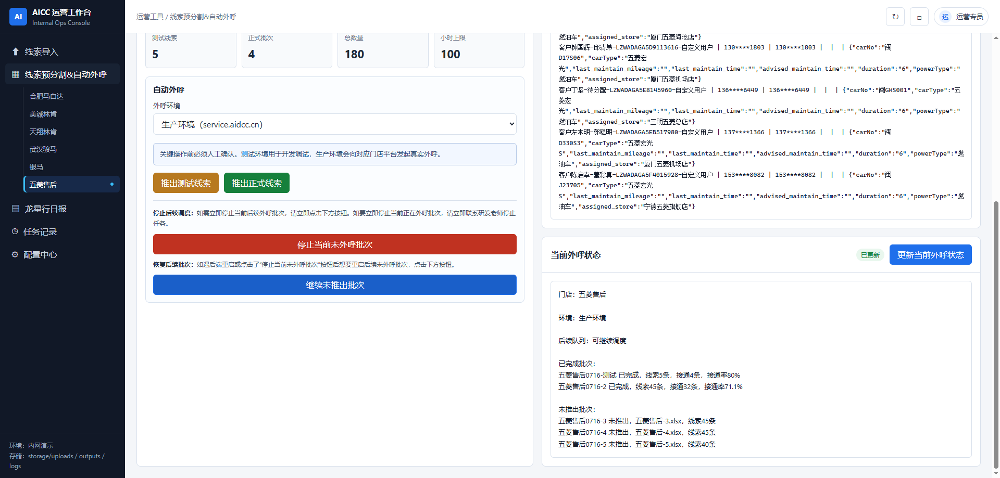

#### 自动外呼租户

以新增五菱售后外呼配置为例，生产环境账户、密码和机器人 ID 为必填项；测试环境字段可以留空。

#### 龙星行日报门店与机器人

以新增龙星行长沙售后为例，门店名、生产环境账号和密码为必填项。<code>mtd_start_date</code> 为可选项，用于指定 MTD 累计统计的起始日期；一个租户门店也可以配置多个机器人。

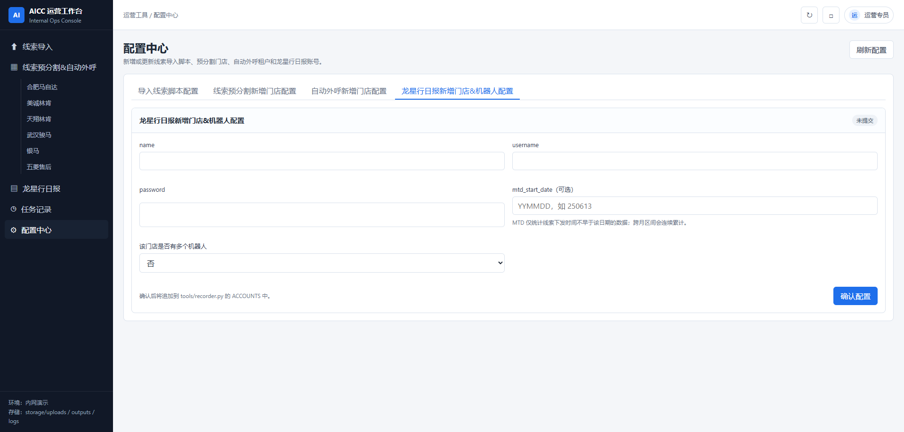

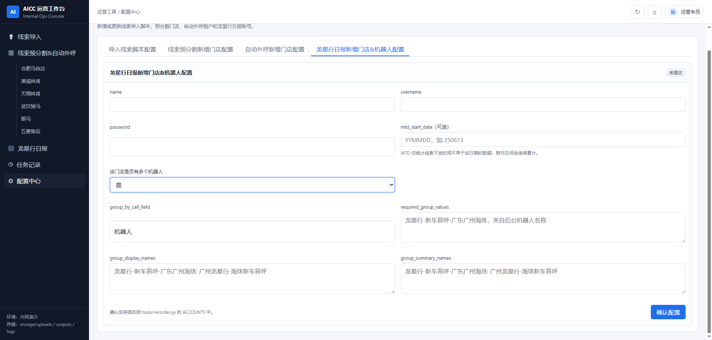

## 技术架构

| 层级 | 技术与职责 |
| --- | --- |
| 前端 | 原生 HTML、CSS 和 JavaScript 单页工作台，通过 FastAPI 静态路由访问 |
| API 服务 | FastAPI，负责路由装配、结构化错误、文件下载和任务查询 |
| 适配层 | lead_import、split_import、outcall、daily_report、robot_quota、task_records、config_center |
| 核心工具 | 原有线索脚本、Excel 分割工具、租户外呼处理器、龙星行日报工具 |
| 状态存储 | SQLite 保存外呼任务恢复状态；文件系统保存上传、输出和日志 |
| 外部系统 | AICC 测试/生产平台接口 |

## 项目结构

~~~text
AICC/
├── aicc-frontend-demo.html                 # 当前使用的前端工作台
├── pictures/                               # README 截图资源
├── 线索变量脚本/
│   ├── glm-proxy/                          # FastAPI 服务与功能适配层
│   ├── 线索变量脚本/                       # 各门店线索导入脚本
│   └── 建银线索/                           # 线索导入输入与 TXT 输出
├── 建银-线索自动预分割与导入脚本/
│   └── 建银-线索自动预分割与导入脚本/      # 分割、外呼配置与租户处理核心
└── 龙星行报表工具_核心文件_260629/          # 日报抓取、处理与汇总工具
~~~

## 配置说明

### 自动外呼

~~~text
建银-线索自动预分割与导入脚本/建银-线索自动预分割与导入脚本/config.yaml
~~~

生产环境的用户名、密码和机器人 ID 为必填项；测试环境配置可留空。新增租户建议通过配置中心完成，以同步创建预分割门店并刷新左侧菜单。

### 龙星行日报

~~~text
龙星行报表工具_核心文件_260629/tools/recorder.py
~~~

历史日报可通过 <code>REPORT_DATE</code> 指定目标日期。月度横向汇总支持按月份或自定义日期区间生成，并可为门店配置独立的 <code>mtd_start_date</code>。

> [!CAUTION]
> 配置文件可能包含平台凭据。不要在 README、日志、Issue、测试夹具或截图中公开真实密码、令牌和客户敏感数据。

## 验证与测试

提交变更前至少完成以下检查：

1. 对修改的 Python 文件执行语法检查。
2. 运行受影响模块测试；跨模块变更运行完整测试集。
3. 在目标环境打开工作台，检查浏览器控制台和相关 API 请求。
4. 外呼自动化测试使用临时目录和伪平台服务，不直接调用生产平台。

## 数据与安全

- 前端展示手机号等敏感字段时必须脱敏。
- 日志和结构化错误不得返回密码、令牌或完整客户数据。
- 生产外呼、日报重拉、批次停止和覆盖输出均为有副作用操作，执行前必须人工确认。
- storage、日志、SQLite、Excel、TXT 和日期输出目录属于运行产物，不应作为源代码提交。

## 维护说明

- 当前活动前端是仓库根目录的 <code>aicc-frontend-demo.html</code>。
- 后端入口是 <code>线索变量脚本/glm-proxy/server.py</code>。
- 新功能优先通过适配层接入，除非需求明确，不直接重构原有核心脚本。
- 文件名、门店名、批次名和任务类型是前后端契约，修改时需同步检查 API、页面与任务记录。

## 作者

个人作品与持续维护：[@jing200327-cmyk](https://github.com/jing200327-cmyk)
